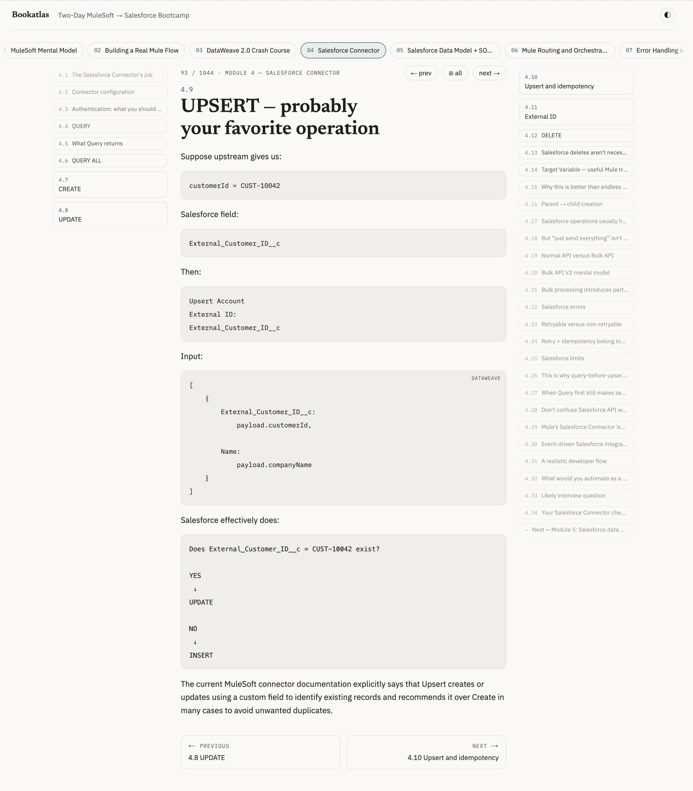
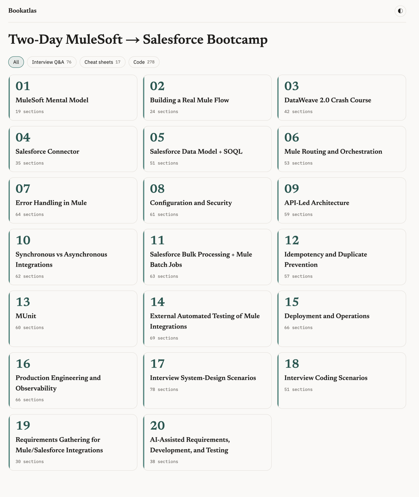
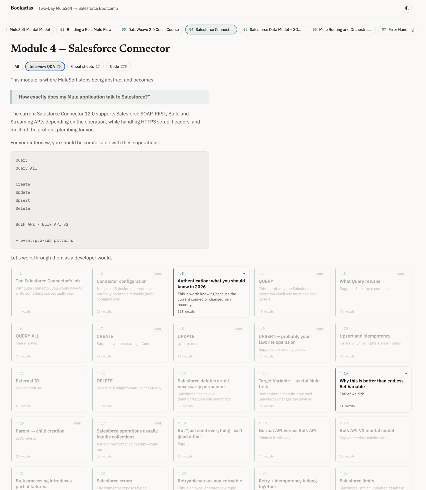
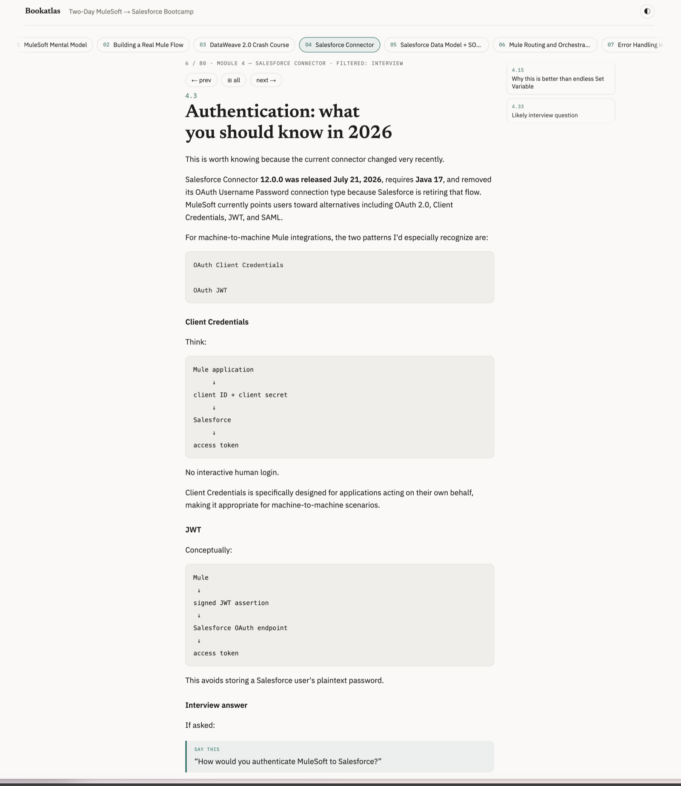

# Bookatlas

Turn folders of markdown — saved LLM conversations, book drafts, course notes — into a **zoomable tile atlas**: chapters as tiles, sections as tiles, click to zoom into a reading view with neighboring sections on side rails and the chapter strip on top. Built for texts that are too big to scroll and too structured to flatten.

Born from a real workflow: long ChatGPT conversations saved as markdown "books" (the bundled demo is one — a 20-module MuleSoft bootcamp generated while onboarding into an unfamiliar stack), then navigated spatially instead of linearly. Bookatlas powers the book library at [modernQAcourse.com](https://modernqacourse.com).

Bookatlas is open source under the [MIT license](LICENSE) — use it, fork it, ship your own library on it. **Site and live demo: [bookatlas.dev](https://bookatlas.dev).**



## Features

- **Spatial navigation** — library → book → chapter grid → zoomed section with distance-compressed rails ("deck" effect); every state is a bookmarkable URL
- **Zoom morph** via the View Transitions API (graceful fallback to instant swap)
- **Keyboard-first** — `←`/`→` prev/next section, `Esc`/`↑` up a level, `[`/`]` switch chapters
- **Content-type filters** — e.g. interview Q&A sections detected at parse time; filtered prev/next crosses chapter boundaries (a book-wide "drill mode")
- **Two parsing profiles**, auto-applied:
  - *chapter files* — a folder of `.md` files, sections split by numbered headings (`# 5.2 Title`); tuned for LLM-exported conversations where heading depth is unreliable
  - *single file* — one `book.md` with `# Chapter N:` (or `## Chapter N:`) headings, `PART` dividers, appendices; depth auto-detected per book
- **Live sources** — books are read from disk per request with mtime caching; edit or extend a book and refresh
- **No database, no build step for content** — markdown in, HTML out, server-rendered
- **Warm-paper design** with dark mode, no CSS framework

## Quickstart

```bash
pnpm install
pnpm dev
```

Open http://localhost:3000 — the demo book (20 chapters, ~1,000 sections) renders from `demo/mulesoft-bootcamp/`.

If port 3000 is already taken on your machine, pass any other port:

```bash
pnpm dev --port 4321       # dev server on http://localhost:4321
pnpm build && pnpm start --port 4321   # production server
```

## Making book files from an LLM conversation

Bookatlas reads plain markdown, and chat assistants already produce it — the bundled demo book is a saved ChatGPT conversation. The workflow:

1. **Steer the conversation toward book shape.** Ask for long, structured answers with numbered sections (`5.1`, `5.2`, …) — the numbering is what becomes tiles. One big themed exchange (or a few) makes one chapter.
2. **Copy each answer as markdown.** In ChatGPT, click the **Copy** icon under an answer — it lands in your clipboard as markdown, headings and code fences intact. Most other assistants have the same control.
3. **Paste into a text editor and save with an `.md` extension.** One file per chapter: `module-01.md`, `module-02.md`, … A chapter that spans several question/answer exchanges is fine — keep appending the copied answers to the same file.
4. **Keep a number in the filename.** Chapter order is filename sort order, so `module-01.md … module-12.md` (zero-padded) reads in sequence.
5. **Put the files in one folder per book.** The folder can live anywhere on disk (`~/books/kafka-crash-course/`) or inside this repo (`./content/kafka-crash-course/`) — Bookatlas reads it in place, nothing is imported or copied. Editing a file (or dropping in a new chapter) shows up on the next browser refresh.

Alternatively, if you already have a whole book in a single markdown file with `# Chapter N:` headings — an export from a writing tool, a compiled draft — save it as `book.md` in its own folder and register it with `"mode": "single-file"`.

## Adding your books

Point Bookatlas at your book folder in `books.config.json` (committed) or `books.config.local.json` (gitignored — your private library; same-id entries override public ones). The `id` you choose becomes the URL: `/b/my-book`.

```jsonc
{
  "books": [
    {
      "id": "my-book",              // URL segment
      "title": "My Book",           // optional for single-file books (derived from the title heading)
      "path": "./content/my-book",  // relative to repo root, or absolute
      "mode": "single-file",        // omit for a folder of chapter files
      "accent": "#5b4a8a"           // per-book accent color
    }
  ],
  "collections": [
    {
      "dir": "/path/to/library",    // every subdirectory with a book.md becomes a book
      "mode": "single-file"
    }
  ]
}
```

Check how your corpus parses before styling anything:

```bash
pnpm parse:check
```

It prints per-chapter section counts and fails on structural anomalies (missed splits, leaked headings) — useful as a tripwire when a book grows or a new corpus arrives with slightly different heading conventions. Per-book `parser` overrides (custom chapter-title pattern, heuristic toggles) are the escape hatch for corpora the defaults don't fit.

## Screenshots

**A book's chapters as tiles** — the whole book on one screen:



**Inside a chapter, with a filter active** — non-matching sections dim but stay in place, so the spatial map survives filtering:



**The interview drill** — reading a filtered sequence: prev/next skips to the nearest matching section, across chapter boundaries:



## How parsing works (and why it's weird)

LLM-exported markdown lies about structure: the first section of a chapter might be `##` while the rest are `#`, children sometimes sit *deeper* than their parents, and stray `# emphasis` lines aren't headings at all. Bookatlas therefore splits sections by **numbering patterns and title heuristics, never by heading depth alone** — and treats well-formed single-file books (where depth *is* reliable) as the easy special case. Code fences are always respected; a `# comment` inside a fence never becomes a section.

## Notes for deployers

- All markdown is rendered to HTML **server-side**; raw `.md` content is never serialized to the client, exposed by any route, or reachable through the asset endpoint (images only, extension-allowlisted).
- Content outside the repo is read at request time — deploy needs the book directories on the server's filesystem.
- Routes are dynamic (`force-dynamic`); there is intentionally no static export of content.

## License

MIT © Yuri Syuganov
